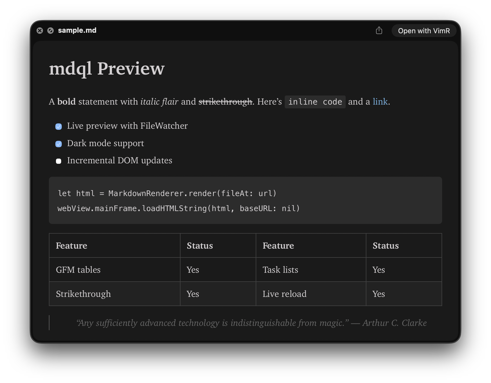

# mdql

A macOS Quick Look extension for previewing Markdown files. Press Space on any `.md` file in Finder to see a rendered preview — with **live updates** as the file changes.



## Features

- **Live preview** — edit a Markdown file and watch the QuickLook preview update in real-time
- **GitHub Flavored Markdown** — tables, task lists, strikethrough, fenced code blocks with language hints
- **Follow `.md` links** — click a relative `.md`/`.markdown` link to navigate to that file inside the same preview, with a back button and hover status bar showing where each link goes
- **Light & dark mode** — automatically follows system appearance
- **Inkpad-inspired styling** — clean typography with thoughtful spacing and color tokens. Big shout out to Mariusz and Matt for the epic work together on Inkpad nearly a decade ago
- **Fast** — uses Apple's [swift-markdown](https://github.com/swiftlang/swift-markdown) (cmark-gfm) for native-speed parsing

## Requirements

- macOS 12.0+
- Xcode 15.0+

## Install

```bash
make install
```

This builds a Release binary, copies it to `~/Applications/`, cleans up all stale DerivedData and duplicate registrations, registers the QuickLook extension, and verifies everything is correct. Press Space on any `.md` file in Finder to preview.

## Test

```bash
make test
```

## How Live Updates Work

QuickLook extensions run in a strict sandbox that blocks the obvious approaches (JS polling, embedded HTTP server, WebSocket, SSE). See [docs/live-updates.md](docs/live-updates.md) for the full write-up on what fails, what works (view-based preview + WKWebView + DispatchSource FileWatcher + base64 innerHTML injection), and why installation location matters.
